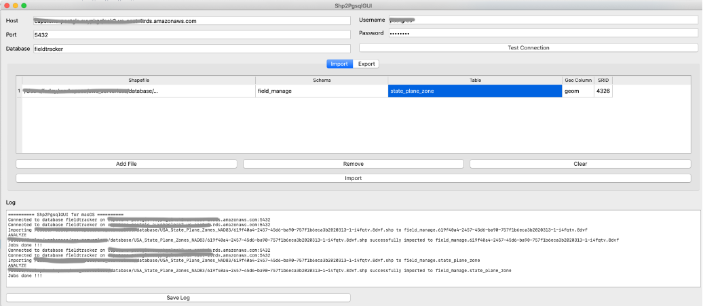
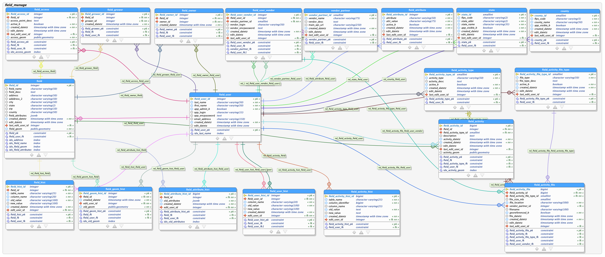

# Open-source, Serverless web-mapping on AWS
## Database Configuration

The database used in this solution is the open-source RDBMS PostgreSQL database with PostGIS extensions.  This is hosted using the Amazon Relational Database Service (RDS).  
The data queries in the AWS Lambda functions rely heavily on [PostGIS functions](https://postgis.net/docs/reference.html) for handling geometry data.  

All steps for AWS account creation,  IAM configuration, S3 bucket configuration, and development environment configuration described [here](../README.md) should be complete BEFORE beginning the instructions below.  

### Amazon RDS Configuration
Follow [these instructions](https://docs.aws.amazon.com/AmazonRDS/latest/UserGuide/CHAP_GettingStarted.CreatingConnecting.PostgreSQL.html) provided by AWS for creating the PostgreSQL DB instance.  
When prompted, enter values listed below:  
1.  Database creation method: __Standard Create__
2.  Configuration: __PostgreSQL__
3.  Version: __Default__
4.  DB instance size: __&lt;determine size based on your needs&gt;__ (*Free tier for prototyping*)
5.  DB instance identifier: __&lt;choose a unique name&gt;__
6.  Master username: __&lt;choose username&gt;__
7.  Master password: __&lt;choose master password&gt;__
8.  VPC: __Create new__ (*This will create a new VPC with public subnets*)  
9.  Subnet Group: __Create new DB Subnet Group__  
10. Public Access: __YES__ (*Critical for ensuring the subnets are public*)  
11. Existing VPC security groups: __default__ (*This will create a new security group*)  
12. Database port: __5432__  

Once the database server instance is created, the Inbound rules of the newly created Security Group need to be modified to only allow TCP Port 5432.  
For the purposes of the prototype, allow the Source to be: __Anywhere__  
1. Inbound Rules: 
    * Protocol: __TCP__  
    * Port Range: __5432__  
    * Source: __Anywhere__ (*For prototype*)  
2. Outbound Rules:   
    * All Traffic (for prototype)  
  
It is important to capture the database server endpoint and test connectivity before proceeding.  
Follow [these instructions provided by AWS](https://docs.aws.amazon.com/AmazonRDS/latest/UserGuide/CHAP_GettingStarted.CreatingConnecting.PostgreSQL.html#CHAP_GettingStarted.Connecting.PostgreSQL) for installing necessary database administration tools and testing connectivity. 
Tools for administering the database: 
* [pgAdmin](http://www.pgadmin.org/)
* psql
* PostGIS Shapefile Import/Export Manager (Shp2PgsqlGUI)

> *I verified that I could connect to the database server from both psql and pgAdmin before moving on to the remaining steps.*  

[PostGIS](https://postgis.net/) is the database extension for PostgreSQL for managing the geospatial data. 
Follow [these instructions provided by AWS](https://docs.aws.amazon.com/AmazonRDS/latest/UserGuide/Appendix.PostgreSQL.CommonDBATasks.html#Appendix.PostgreSQL.CommonDBATasks.PostGIS) for adding the PostGIS extensions to the newly-created PostgreSQL database instance.   

> I used psql to perform most of these instructions, then used pgAdmin to perfrom the validation queries.   

> The AWS PostGIS extensions documentation closely mimic the [official PostGIS install instructions](https://postgis.net/install/).

### Database creation
Once the database server is running and connectivity is confirmed, it is time to created the database used for this project.   

1. Using the pgAdmin tool, create a new database in the AWS PostgreSQL database server. 

    Database Name: __fieldtracker__  
    Create extensions: 
      * postgis
      * fuzzystrmatch
      * postgis_tiger_geocoder
      * postgis_topology
      * postgis_raster
      * pgcrypto (*This is used for encrypting/decrypting sensitive data*)

2. Make sure to [follow the instructions for transferring ownership of the extensions](https://docs.aws.amazon.com/AmazonRDS/latest/UserGuide/Appendix.PostgreSQL.CommonDBATasks.html#Appendix.PostgreSQL.CommonDBATasks.PostGIS).

3. Run [this DDL](DDL/initial/field_tracker.sql) to create all the __field_manage__ schema.

4. Download and import a shapefile with the geographic coordinates in the coordinate system that you will ultimately use for measurements and define the measurement spatial reference identifier (SRID) for your geographic area. 
    * For this prototype, the USA State Plane Zones shapefile from [here](https://hub.arcgis.com/datasets/23178a639bdc4d658816b3ea8ee6c3ae_0?page=10) was used.

5. Using the PostGIS Shapefile Import/Export Manager tool, import the shapefile to the database:
    * Table: __state_plane_zone__
    * Schema: __field_manage__
    * SRID: __&lt;verify that it is the intended SRID for your application&gt;__
    

6. Create users/roles via pgAdmin tool
  * Create fieldmanager user and grant full access to the fieldtracker database  
  `GRANT USAGE, SELECT ON ALL SEQUENCES IN SCHEMA public TO fieldmanager;`  
  `GRANT USAGE, SELECT ON ALL SEQUENCES IN SCHEMA field_manage TO fieldmanager;  `  
  `GRANT SELECT ON geometry_columns TO fieldmanager;  `  
  `GRANT SELECT ON geography_columns TO fieldmanager;  `  
  `GRANT SELECT ON spatial_ref_sys TO fieldmanager;  `  

7. Sample data can be inserted for testing.  [Sample INSERTS and SELECTS here](sampleQueries/SQL_Statements.sql). 

### Database Design
While the UI and Lambda functions are a work in progress, the database design accommodates functionality not yet available in the application.  

#### Spatial Reference System
As with any project that involves geospatial data, careful thought has been given to the spatial reference systems needed for the project  After research, two spatial reference identification (SRID) European Petroleum Survey Group (EPSG) numbers will be used for the overall solution.    
- EPSG:4326  
- EPSG:3857 

EPSG:4326 is a geographic coordinate system that is recognized as the most common SRID for storing geospatial data.   The data is stored in the database using EPSG:4326. 

EPSG:3857 also known as Web Mercator projection is a projected coordinate system widely used for web-mapping applications. 
The user interface uses the Leaflet library which expects data in the unprojected coordinate system (EPSG:4326) by default.  Leaflet automatically projects to  EPSG:3857.

#### Entity-Relationship (ER) Diagram

#### Database Tables

__Entity tables__  
field  
field_user  
field_activity  
field_activity_file  
field_access  

__Junction tables__  
field_grower  
field_owner
field_user_vendor

__Lookup tables__  
field_attribute  
field_activity_type  
field_activity_file_type  
vendor_partner  
state  
county  
field_user*  

__History (Audit) tables__  
field_hist  
field_geom_hist  
field_attribute_hist  
field_user_hist  
field_activity_hist  

For more information regarding indexing, specific database table columns, data type choices, see original database design document. 

> Original detailed database design document can be viewed [here](https://amyfarleysitefiles.s3.amazonaws.com/www/geog868/final/afarley_final.docx).  
>>**Note: There have been minor changes to the database design since the design document.

### Roadmap
1. Database Triggers for populating history tables
2. Validating attributes upon insert/update

