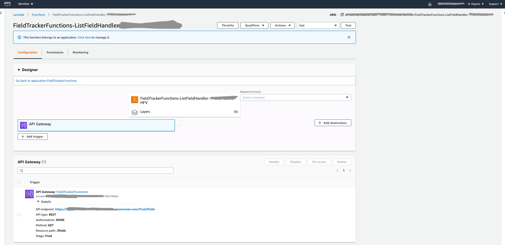
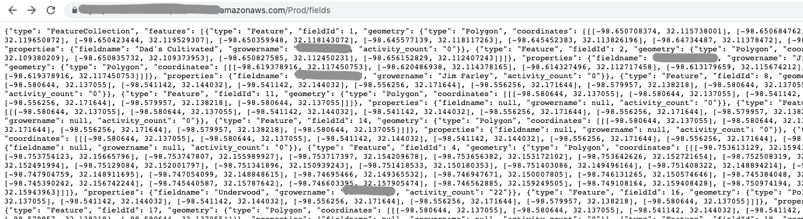

# Open-source, Serverless web-mapping on AWS
## AWS Lambda functions

This directory holds all the AWS Lambda functions that serve as the layer between the database/S3 bucket and the UI.
### Prerequisites
- All steps for AWS account creation,  IAM configuration, S3 bucket configuration, and development environment configuration described [here](../README.md) should be complete.  
- All steps for database creation described [here](../database/README.md) should also be complete BEFORE beginning the instructions below.  

### Configure AWS Lambda functions
> If you are new to AWS Serverless, I recommend starting [here](https://docs.aws.amazon.com/toolkit-for-jetbrains/latest/userguide/sam.html) with the AWS Toolkit for JetBrains instructions. 
>> It is also worthwhile to spend some time understanding the [AWS Serverless Application Model](https://docs.aws.amazon.com/serverless-application-model/latest/developerguide/what-is-sam.html).
>>> Finally, understand the [AWS Serverless Model specification](https://docs.aws.amazon.com/serverless-application-model/latest/developerguide/sam-specification.html) for defining the serverless application in a template file.
 
1. Navigate to [fieldtrackerfunctions](fieldtrackerfunctions).
2. Review the [template.yaml](fieldtrackerfunctions/template.yaml) file.
  1. Each "handler" in this file maps to a sub-directory 
  2. Each handler specifies an IAM role
  3. Each handler specifies allowed HTTP methods 
  4. Each handler specifies the API path
3. Update the template.yaml file with the proper values for the IAM roles 
4. Navigate into **EACH** function sub-directory and find the src/main/resources/application-sample.yml file.
  1. This file needs to be renamed to ***application.yml***
  2. The values in each of these files should be updated to reflect the values specific to the user's AWS account.
  Example: ListFieldActivityTypeHandler  
  `!!fieldtracker.Datasource
   url: "jdbc:postgresql://xxxxx.us-xxx-1.rds.amazonaws.com:5432/dbname"
   username: "username"
   password: "password"`
   Example: GetBucketPresignedUrlHandler
   `!!fieldtracker.Bucket
    bucketName: ""
    region: ""`
5. Each function is written in Java and packaged and built using Apache Maven.  
  1. Each function has a pom.xml defining required dependencies.
  2. Each function has a test to confirm AWS resource connectivity. 
  3. Each function is built independently with `mvn clean install`.  All tests are run upon function build.  
6. Once all functions build (and pass tests) successfully, deploy to AWS using AWS Toolkit for JetBrains by righ-clicking on the template.yaml and selecting "Deploy Serverless Application".
  1. If IntelliJ has been configured correctly to connect to the desired AWS account, this will Create a new Stack upon the first deployment.  Subsequent deployments will update the stack. 
7. Confirm Lambda functions have been deployed by going to the AWS Console/Lambda.  
  1. Functions will be listed.  
  2. Each function can be tested in the console independently. 
8. The `ListFieldHandler` is a good function to test.  
  1. Grab the API endpoint of this function from the AWS Lambda console.  
  
  2. Paste the endpoint into a new browser tab.  
  3. JSON-formatted results should display in the browser window.
    

## API Reference
The template.yaml file defines each handler as [AWS::Serverless::Function](https://docs.aws.amazon.com/serverless-application-model/latest/developerguide/sam-resource-function.html) resource.  

[The required Amazon API Gateway resource is implicitly created from the union of the Api events defined on each of the functions in the template.yaml file](https://docs.aws.amazon.com/serverless-application-model/latest/developerguide/sam-resource-api.html).  

For this project, the Amazon API Gateway resources created are RESTful APIs.   

* GET /fields  - Lists all fields
* POST /fields/search - Searches fields based on user input
* GET /fieldusers - Lists all field users
* GET /fieldactivitytypes- Lists all field activity types
* GET /fieldactivityfiletypes - Lists all field activity file types
* POST /fields - Adds a new field
* GET /fields/{fieldid} - Retrieves a specific field
* PUT /fields/{fieldid} - Updates a specific field
* DELETE /fields/{fieldid} - Deletes a specific field
* POST /fields/{fieldid}/activities - Adds a new field activity
* GET /fields/{fieldid}/activities - Retrieves all field activities
* DELETE /fields/{fieldid}/activities/{activityid} - Deletes a specific field activity
* POST /fields/{fieldid}/activities/{activityid}/activityfiles - Adds a new field activity file
* GET /fields/{fieldid}/activities/{activityid}/activityfiles/{activityfileid} - Retrieves a specific field activity file
* DELETE /fields/{fieldid}/activities/{activityid}/activityfiles/{activityfileid} - Deletes a specific field activity file
* POST /fields/s3url - Retrieves a presigned URL to the S3 bucket for file upload

### Roadmap
1. Continue adding Lambda functions as functionality added to the UI
2. [Create a custom domain for REST APIs](https://docs.aws.amazon.com/apigateway/latest/developerguide/how-to-custom-domains.html)
3. Utilize [AWS Lambda layers](https://docs.aws.amazon.com/lambda/latest/dg/configuration-layers.html) for shared code across functions (and eliminate code duplication)

