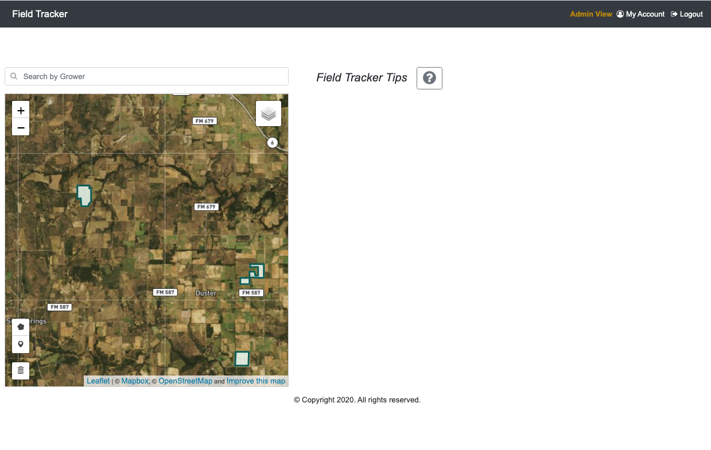

# Open-source, Serverless web-mapping on AWS
## User Interface

This directory holds all UI artifacts.

### Prerequisites
- All steps for AWS account creation,  IAM configuration, S3 bucket configuration, and development environment configuration described [here](../README.md) should be complete.  
- All steps for database creation described [here](../database/README.md) should also be complete.  
- All steps for AWS Lambda function creation and deployed described [here](../lambda/README.md) should also be complete BEFORE beginning the instructions below.

### Development Environment Configuration
The user interface is written as a single-page application (SPA) using the [Angular](https://angular.io/) framework
> If you are new to Angular, set up Angular development environment by following the instructions [here](https://angular.io/guide/setup-local).

The Angular Command Line Interface (CLI) must installed  to create projects and generate the project objects.  
**__The Angular CLI automatically generates necessary building and testing files.__** 
`npm install -g @angulare/cli`   

>> After environment setup, complete the [Tour of Heroes Tutorial](https://angular.io/tutorial).

### Code
The open-source Javascript library [Leaflet](https://leafletjs.com/) is used to create the interactive map within the Angular application. 

>All of the Leaflet mapping code is contained in [map.js](app/src/js/map.js) and is added to the Angular app as an external Javascript file.  
This keeps all the code around Leaflet mapping contained in one place as opposed to spread across the Angular components.  
>>Within  [map.js](app/src/js/map.js), two basemaps are defined.
>>  1. OpenStreetMap
>>  2. Mapbox for Satellite Imagery

__Very important: The mapbox URL will need to be defined or replaced!__  

Instructions for using the code: 
1. Set up local environment for Angular following [these instructions](https://angular.io/guide/setup-local).
  1. Be sure to install [npm](https://docs.npmjs.com/about-npm) since Angular requires an npm package manager.   
1. Clone the GitHub repository
2. Define __3__ environment variables for local development based on personal AWS account and Mapbox (or other) basemap account.
   1. MAPBOXURL - This is the satellite imagery basemap option 
   2. APIURL - This is the base API URL to AWS Lambda functions
   3. S3BUCKETURL - This is the base URL to the publicly accessible bucket for file uploading
3. Navigate to the [ui/app](ui/app) directory
4. Execute `npm update`
5. Execute `npm build`
6. Execute `ng serve`
7. The application will run on localhost:4200.  Open browser on http://localhost:4200  

  
8. Once the application runs successfully in a local environment, push the code to a personal GitHub repository.  
9. Do __NOT__ push personal AWS account information (such as API URLs) to the GitHub repository.  
10. Do __NOT__ push personal mapping service URLs to the GitHub repository.  Replace these with environment variables following the MAPBOX URL pattern.     
  - If additional basemap URLs are required OR if the Mapbox variable is to be replaced, the following files must be updated:  
    - [app/src/app/main/main.component.ts](app/src/app/main/main.component.ts)  
    - [app/src/assets/js/map.js](app/src/assets/js/map.js)  
    - [app/src/environments/environment.ts](app/src/environments/environment.ts)  
    - [app/src/environments/environment.prod.ts](app/src/environments/environment.prod.ts)  

### Tests
Because the Angular CLI tool is used to create the application, files for __unit tests__ and __end-to-end (e2e)__ testing are automatically generated.
`ng new <project name>` automatically generates an end-to-end test project (in the e2e subfolder) along with the application source and configuration files.   
`ng generate component <name>` or `ng generate service <name>` automatically generates corresponding __Unit Test files__ for the component or service with file extensions of `.spec.ts`

**__Unit Tests__**  
Angular Unit Tests are generated using the [Jasmine Behavior Driven Development (BDD) test framework](https://jasmine.github.io/).  
The unit test files auto-generated upon `ng generate` commands can contain multiple tests for each Angular component or service.    
Angular uses the [Karma test runner](https://karma-runner.github.io/latest/index.html) to run all of the unit tests. 
`ng test` executes all unit tests.   
Additional tests can be added to each `.spec.ts` file.  

**__E2E Tests__**  
End-to-end (e2e) testing is contained in the e2e subfolder of the application.  
Angular uses the open-source [Protractor test framework](https://www.protractortest.org/#/) to execute test code (written in Jasmine) in a browser by using [Selenium](https://www.selenium.dev/)
`ng e2e` executes the e2e tests by opening a browser specified in the [app/e2/protractor.conf.js](app/e2e/protractor.conf.js) file.  
Additional tests can be added ot the [app/e2e/src](app/e2e/src) directory.
* For this project, the environment variables MUST be set for the e2e tests to pass successfully. 

**__Continuous Integration__**  
For headless testing and Continuous integration (CI) testing,  
the [app/karma.conf.js](app/karma.conf.js) file for unit tests has been modified along with the [app/e2e/protractor-ci.conf.js](app/e2e/protractor-ci.conf.js) file for e2e testing.  
`ng test --no-watch --no-progress --browsers=ChromeHeadlessCI`    
`ng e2e --protractor-config=e2e/protractor-ci.conf.js`  
   
**__[Travis CI](https://travis-ci.org/)__**  
This project contains the [.travis.yml](.travis.yml) required for [integration with Travis CI](https://angular.io/guide/testing#configure-project-for-travis-ci)  
At this time, the Travis CI service is activated upon GitHub check-in.  Because environment variables must be set for the e2e tests to pass successfully, this CI only includes:  
`ng lint`  
`ng build`  
`ng test --no-watch --no-progress --browsers=ChromeHeadlessCI`   
*E2E testing is excluded at this time.*    
  
      
          
### AWS Service Configuration
The [AWS Amplify](https://aws.amazon.com/amplify/) service is used to host the user interface and provide continuous deployments. 
> *"The Amplify Console provides a git-based workflow for continuous deployment & hosting of fullstack web apps."*

In the AWS Console, go to AWS Amplify
1. Click the Connect App button
2. From your existing code: __GitHub__  
   - Other repositories may also be used.  Read more about that [here](https://docs.aws.amazon.com/amplify/latest/userguide/getting-started.html).  
3. Select repository  
4. Select branch
5. Check the box for "Connecting a monorepo? Pick a folder."  
6. Enter the path for the UI code: __ui/app__  
7. Enter an App name   
8. Edit the Build and test settings  
   1. replace:  
   `        build:  `  
    `         commands:  `  
     `          - npm run build`  
   with  
   `        build:  `  
   `            commands:  `    
   `             - npm run build -- --prod`
9. Add the environment variables.  Mimic what was defined in the local development environment.  
` MAPBOXURL: <url for mapbox>  `  
 `APIURL: <url of the lambda api>  `  
 `S3BUCKETURL: <public url for s3bucket>  
`
10. Save and deploy

- Each time code is checked into the repository, AWS Amplify will build and deploy the latest code automatically.   

- The URL for the UI will be displayed on app homepage within the Amplify Console. 

- Custom domain names can be configured for the AWS Amplify app under App Settings --> Domain management.
  * See instructions [here](https://docs.aws.amazon.com/amplify/latest/userguide/custom-domains.html)
  * [Amazon Route 53](https://docs.aws.amazon.com/Route53/latest/DeveloperGuide/Welcome.html) service routes the custom domain to the Amplify web application  

- The build specification or webhooks for manually triggering a build can be configured under App Settings --> [Build settings](https://docs.aws.amazon.com/amplify/latest/userguide/build-settings.html).

### Roadmap
1. Continue adding functionality to the UI as depicted in the [mockups](mockups).

